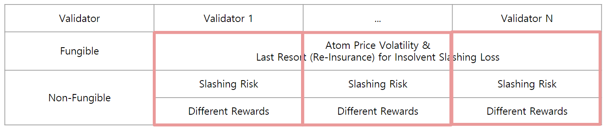
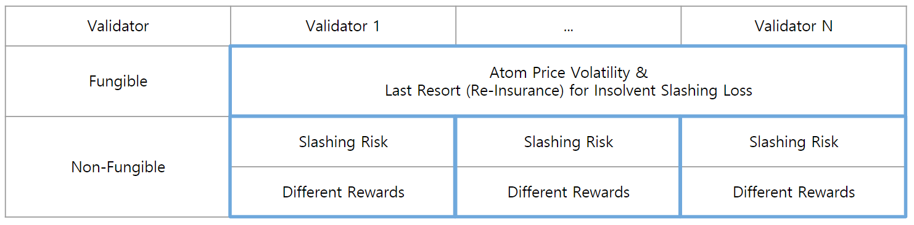
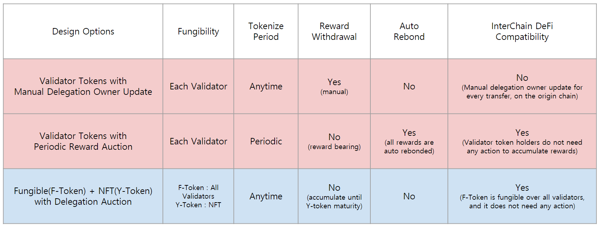

## **1. Context**

### **Delegated Proof of Stake : the Standard Concensus Mechanism for Next Generation Blockchains**

- Most newly born public blockchains adopt proof of stake, especially delegated proof of stake
- dPoS has demonstrated the most stable and secure concensus mechanism for past several years

### **Liquid Staking : Unlock the Staked Assets for Great Potential Economic Value**

- Most staked assets in dPoS blockchains are locked in the blockchain protocols
- Unlocking the staked assets have great economic potential to thrive growth of investment and use-cases in dPoS networks

### **Delegation Tokenization : Protocol Level Base Layer Support for Liquid Staking**

- There should exist very secure support from the core blockchain modules for liquid staking
- Simple delegation tokenization feature on dPoS is necessary to
    - allow many staking derivatives applications to bring innovated financial utilities
    - with securely built base layer protocol as a building block
- The base layer delegation tokenization should have simple and general design

## 2. Important Properties

### Fungibility

- Fungible over same validator or over all validators?
- Fungible over staking time period?
- Can we expand fungibility further with other mechanism upon this model?

### Simplicity

- Does this model require new functionalities to be adopted?
- Is the process of the model easy to understand?
- Is there many complex steps which might occur bugs?

### Reward Distribution

- Does delegation token holders need to deal with actual rewards?
- Can users trade accrued rewards without rewards withdrawal?
- Is the reward distribution mechanism creates complexity over handling delegation tokens in contracts?

### Slashing Risk Responsibility Alignment

- Is the slashing risk well utilized to secure dPoS concensus?
- Is the model creating the "Tragedy of Common" problem?
    - Right person is responsible for slashing event? Good alignment of incentives and responsibility?
    - Do we have mechanism to prevent it?

### Independency

- Is the model requiring other modules or functionalities as dependency?
- Does the model break down during the dependent functionality failures?
- Does the model require significant logic changes on existing modules such as staking or distribution?

### Generality

- Is the model adoptable for most Cosmos-SDK based networks?
- Is the model demanding strong assumption on staking environment?

### IBC/Contract Compatibility

- The delegation token can be transferred to different blockchains via IBC
    - Is there no problem on the model when the delegation token goes outside the origin chain?
- Lots of delegation token will be held by contracts or modules, inside or outside the origin chain
    - Is there no significant complexity around handling delegation tokens by contracts or modules?

## 3. Delegation Decomposition Dimensions

### Delegation Decomposition by Validators : Vertical

### Delegation Decomposition by Fungibility : Horizontal

## 4. Design Options

### Validator Tokens with Manual Delegation Owner Update

**Concept**

- A delegation is tokenized to a validator token, redeemed from a validator token
- The validator token owner can manually update the owner of the delegation share

**Advantages**

- A technically natural approach to tokenize the delegation share
- Simple adjustment on existing module without additional functionality

**Limitation**

- Delegation share ownership update transaction on the origin chain
    - Possession of the validator token should be verified upon ownership update of the delegation share
    - Therefore, the validator token should be located in the origin chain for this transaction
- Complexity arises on ownership update actions for modules & contracts on different chains

### Validator Tokens with Periodic Reward Auction

**Concept**

- A delegation can be tokenized/redeemed to a validator token at periodic block height
- At every periodic block height, accumulated rewards are withdrawn to the reward auction fund
- Tokens in the reward auction fund are sold for bonding token, via periodic auction
- Incoming bonding tokens from the auction are auto rebonded

**Advantages**

- Reward bearing
    - Interchain DeFi compatible
    - HODL : Validator token holders do not need to perform any action
- Auto rebond
    - Accumulated rewards are periodically auto rebonded

**Limitation**

- Tokenization/Redemption is allowed only at periodic block height : Que should be introduced
- Auction functionality should be introduced : Multiunit auction

### Fungible(F-Token) + NFT(Y-Token) with Delegation Auction

**Concept**

- Delegation is tokenized into fungible(F-Token) and non-fungible(Y-Token) tokens with maturity
- Redemption before maturity is possible by returning F-Token and Y-Token
- At maturity, delegation ownership is sold by auction
    - F-Token is used as auction bid token for any matured tokenized delegation
    - Auction winner receives the ownership of the delegation
    - Y-Token holder gets partial amount of F-Token at maturity

**Advantages**

- Completely fungible F-Token creation without any necessity of on-chain action
- Decomposition of delegation into two financially distict types of tokens
    - More precise investment & trading options for users
    - Providing better DeFi building-block for further creative staking derivative products

**Limitation**

- Y-Token is not fungible (NFT)
- Delegation auction functionality should be introduced
- Y-Token insolvency upon harsh slashing environment will cause F-Token dilution
